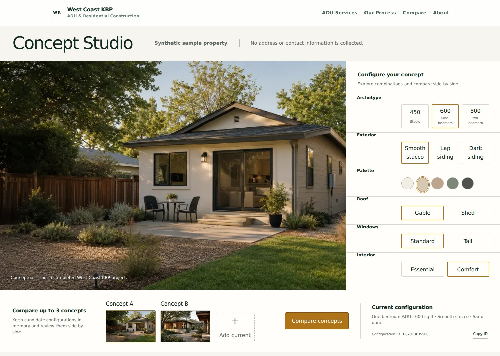
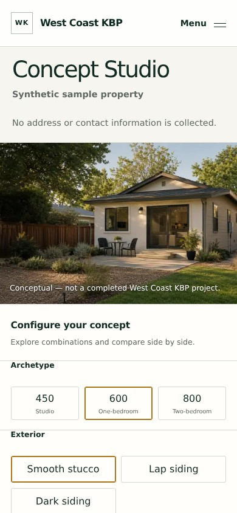

# RUN-0013: Concept Studio spike — no PII, no capture, 2D-first

- **Task packet:** TASK-0013
- **Timestamp:** 2026-08-04T23:18:20Z
- **Executor:** Codex builder/verifier
- **Runtime bytes under test:** `44cfc770ec88fc33316b404141c832496935969c`
- **Result:** partial — engineering and owner-authorized local browser gates accepted; deployed p75 performance, non-author review, and Owner disposition pending

## What was done

Prepared and browser-tested the selected Editorial Workbench as a deterministic
`/studio` implementation on `main@c10ed964455288865cbf981c47bad326717eaba0`.
The visitor can explore three curated archetypes, data-defined option compatibility,
in-memory comparison, and a stable SHA-256 configuration identifier. No address,
contact, price, GIS, AI, persistence, or external provider path is introduced.

The ChatGPT cloud browser failed before tab acquisition. The Owner authorized a
one-time local Playwright fallback for `/studio`. The fallback used an isolated
`/tmp` toolchain and added no repository or product dependency.

## Evidence (whitelisted fields only)

| Field | Value |
| :---- | :---- |
| timestamp | 2026-08-04T23:18:20Z |
| test variant ID | `task-0013-editorial-workbench-local-playwright` |
| event type | `local_browser_visual_interaction_qa` |
| accept/reject result | pass for local browser scope; overall task remains partial |
| latency marker | production compile 4.8 s; deployed p75 LCP/INP/CLS not measured |
| error class | `cloud_browser_runtime_initialization_failed_recovered_by_owner_authorized_local_fallback` |
| sanitized summary | Chromium 149 / Playwright Core 1.62.1 tested desktop 1487×1058 and mobile 390×844. Page identity, meaningful render, no framework overlay, responsive layout, option changes, data-defined refusal, deterministic replay, comparison, clipboard, visible keyboard focus, console health, same-origin network behavior, and empty cookies/Web Storage passed. |

## Browser checks

| Check | Result |
| :---- | :----- |
| Desktop and mobile page identity / meaningful render | pass |
| Framework overlay | none |
| Console warnings/errors and page errors | 0 |
| Failed network requests | 0 |
| Cross-origin requests | 0 |
| Cookies, localStorage, sessionStorage | empty |
| Page-level horizontal overflow | none at both viewports |
| Archetype and option state change | pass |
| Data-defined disabled/refusal state | pass |
| Same input replay hash | `A799C649EE4F` on both runs |
| Clipboard full SHA-256 matches visible prefix | pass |
| Three-concept in-memory comparison | pass |
| Keyboard traversal and visible 3 px focus outline | pass |

## Golden screenshots

Desktop default state, 1487×1058:

SHA-256: `1f57f3f56e2ec18c7960736d754eeaeb72cb1eaaa58885dae54e2165b52f7ae4`

Mobile default state, 390×844:

SHA-256: `725fee4dbb4e8c87206f8f8403dfb5fc6e8c6fed4391173a124b0f48dd0c2c28`

## Visual comparison ledger

- The title/privacy rail, large conceptual scene, right-side parameter stack,
  comparison rail, configuration ID, and mobile stacked workbench match the
  selected Editorial Workbench direction.
- Text controls replace decorative icon/texture thumbnails. This is intentional:
  the task requires a typed 2D catalog and adds no decorative dependency.
- The implementation compares up to three concepts rather than the two shown in
  the reference. TASK-0013 explicitly allows two to three candidates.
- No P0/P1 clipping, overlap, unreadable text, scroll trap, or page overflow was
  observed. Full-page capture stitching can repeat the sticky global header, so
  acceptance uses viewport and component-region evidence rather than treating
  the stitching artifact as product output.

## Engineering checks

- `npm test` — 63/63 passed.
- `npm run lint` — passed.
- `npm run build` — passed; `/studio` statically prerendered.
- Deterministic replay and SHA-256 known vector — passed.
- Data-defined refusal and fail-closed construction — passed.
- Source-level zero-egress/capture/storage probe — passed.

## Boundary status

- No PII, address, form, capture, contact surface, storage, pricing, GIS, AI, or WebGL.
- No repository or product dependency was added for browser QA.
- Catalog assets are repository-controlled conceptual images with explicit license rows.
- Candidate configurations remain in browser memory and are not sent or persisted.
- Conceptual-project and no-buildability/no-price/no-schedule disclaimers remain visible.

## Open acceptance gates

- Deployed preview mobile p75: LCP ≤ 2.5 s, INP ≤ 200 ms, CLS ≤ 0.1.
- SHA-pinned non-author review on the final evidence HEAD.
- Owner disposition.
